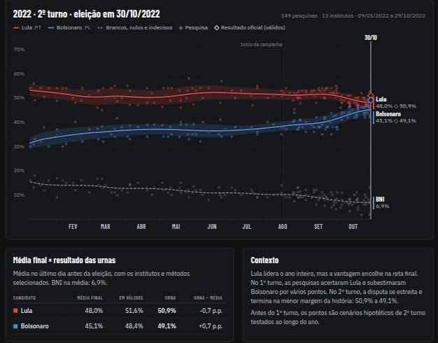
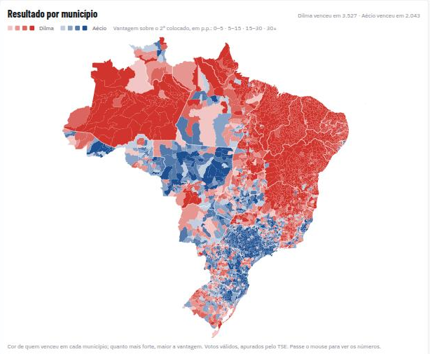
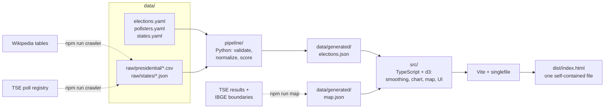

# Urna: Brazilian election poll tracker

[](https://github.com/danillog/urna/actions/workflows/ci.yml)

Every published poll for Brazil's presidential, governor and Senate races, a smoothed average per candidate, and a ranking of which pollsters got closest to the official result. It runs as **a single offline HTML file**.

**Live:** [danillogomes.com/urna](https://danillogomes.com/urna/) · The page is in Portuguese; code and docs are in English.



## Features

- **Nearly 1,400 polls**: president 2010–2026 (both rounds), plus 2026 governor and Senate races in all 27 states.
- **Live re-averaging.** Turn pollsters or interview methods (in person, phone, online) on and off, and the trend lines are recomputed in the browser.
- **Polls vs. ballot box.** For past elections, the final average is converted to valid votes and compared with the official TSE result.
- **Map tab: 30 years of results by municipality.** All 5,570 municipalities for every presidential round since 1994 and every mayor election since 1996. Press play to watch the map change election by election, click a party to follow it through time (say, where the PT won city halls from 1996 to 2024), and zoom in down to single municipalities: pick a state, use the +/− buttons, pinch, or ctrl/⌘ + scroll.
- **Americas tab.** Every country of the Americas since 2000, colored by the ideological family of whoever won its latest national election (president, or the governing party in parliamentary systems). Press play to watch left and right waves cross the continent. Where sources have them, states and provinces show their local winner (72 of 210 elections, including the US, Canada, Mexico, Brazil, Argentina, Colombia and Chile). The same map can switch to the Human Development Index (UNDP; Brazil by state, from the Atlas of Human Development), purchasing power (median income per person from household surveys, PPP, World Bank PIP), cost of living (price level of household consumption, US = 100, World Bank ICP) and electoral democracy (V-Dem). The Brazil map tab also shows the municipal HDI of the 1991, 2000 and 2010 censuses.
- **Pollster accuracy.** Each pollster's last poll before election day is scored. For the current election, the table shows each pollster's track record since 2010.
- **Shareable views.** The selection lives in the URL, e.g. [`?office=governor&uf=SP`](https://danillogomes.com/urna/?office=governor&uf=SP) or [`?year=2022&exclude=Gerp,Palver`](https://danillogomes.com/urna/?year=2022&exclude=Gerp,Palver).
- **Accessible and themable.** Keyboard navigation, a full data table, colorblind-safe palette, light and dark mode.



**Live links:** [mayors elected in 2024](https://danillogomes.com/urna/?view=map&office=mayor&year=2024) · [the PT's city halls since 1996](https://danillogomes.com/urna/?view=map&office=mayor&year=1996&focus=PT) · [2002 runoff](https://danillogomes.com/urna/?view=map&office=president&year=2002&round=r2) · [Rio de Janeiro's mayors in 2024](https://danillogomes.com/urna/?view=map&office=mayor&year=2024&uf=RJ)

## How it works



| Layer | Stack | Responsibility |
|---|---|---|
| `data/` | YAML, CSV, JSON | The only source of truth: polls, dates, results, parties, colors, events, context. |
| `pipeline/` | Python 3.11, PyYAML | Validates every poll (dates, duplicates, rounding-aware sums), normalizes pollster names, scores accuracy, writes `elections.json`. |
| `src/` | TypeScript, d3 modules | Smoothing, state and URL sync, chart and tables. Copy lives in `src/i18n/pt-BR.ts`. |
| build | Vite + `vite-plugin-singlefile` | Inlines scripts, styles, data and map into one file: 4 MB, 1.6 MB gzipped. The map data is parsed only when its tab opens. |

The generated dataset is committed. The web app builds without Python, and CI fails if the dataset is stale.

## Methodology

**Trend line.** Each day gets a local linear regression over nearby polls, weighted with a Gaussian kernel. The bandwidth is 14 days over an election year, 4 days for the short presidential runoff campaign and 10 days for state runoffs. A local linear fit, unlike a moving average, does not lag behind a trend.

**Weights.**
- A poll's weight grows with the square root of its sample size, clamped to 500–5,000 interviews.
- A pollster that publishes several rounds within 7 days (daily trackers) has its weight divided by the square root of that count, so it cannot dominate the average.

**Band.** ±1 weighted standard deviation of the polls around the line.

**Few polls.** With fewer than 3 polls, the line only connects the daily means.

**Accuracy.** Each pollster is scored on its last poll with fieldwork ending within 10 days before the election. Poll and result are both rescaled to shares of the candidates in the result. That puts total-vote polls and the valid-vote result on the same footing. Two measures:
- *Mean error*: the average absolute gap, in points.
- *Margin error*: the error on the gap between the top two.

**Data rules.**
- Dates are the last day of fieldwork.
- Values are total votes in the prompted scenario.
- *BNI* (blank, null, undecided) is shown as its own dashed line.
- First-round polls published only as valid votes are left out, because they are on a different scale.

## Getting started

Requirements: Node 20+ and [uv](https://docs.astral.sh/uv/) (Python is only needed to change data).

```bash
npm install
npm run dev          # http://localhost:5173
npm run build        # → dist/index.html, ready to upload anywhere
```

```bash
uv sync
npm run data         # rebuild data/generated/elections.json
npm run check        # typecheck, tests, lint, dataset freshness
```

| Script | What it does |
|---|---|
| `npm run dev` | Dev server with hot reload |
| `npm run build` | Typecheck and build `dist/index.html` |
| `npm run crawler` | Find new polls (see below) and regenerate the dataset |
| `npm run data` | Validate sources and regenerate the dataset |
| `npm run americas` | Rebuild the Americas tab: elections, results by region, boundaries, families and indicators |
| `npm run map` | Download TSE results not yet cached (≈2.5 GB in total) and rebuild the municipality map |
| `npm test` / `npm run test:data` | Vitest (web) / pytest (pipeline) |
| `npm run check` | Everything CI runs |

### Finding new polls

```bash
npm run crawler              # add new presidential polls, report what is still missing
npm run crawler -- --dry-run # report only
git diff data/raw            # review what was added
```

The crawler reads two sources. Each covers what the other cannot:

| Source | What it gives | What the crawler does with it |
|---|---|---|
| [Wikipedia poll tables](https://en.wikipedia.org/wiki/Opinion_polling_for_the_2026_Brazilian_presidential_election) | The numbers, for presidential polls | Appends polls that are missing from the CSVs and flags polls whose numbers disagree with the dataset. |
| [TSE poll registry](https://dadosabertos.tse.jus.br/dataset/pesquisas-eleitorais-2026) | Every registered poll (pollster, dates, sample), updated daily, but not the results | Confirms each new poll and lists published polls that are still missing, national and per state. |

A Wikipedia poll is added only when:
- **it is confirmed:** the TSE registry has a matching registration, or its pollster already has polls in that race;
- **it is unambiguous:** one scenario matches the race (for a runoff, exactly the two candidates), and there is a blank/null/undecided column, since a poll without one may be valid votes only.

Everything else is listed for a human to check. Polls rejected on purpose go in `skip_polls` in `data/elections.yaml`, so they are not proposed again. State polls have no machine-readable source with numbers: the registry checklist says which ones to look up.

### Adding a poll by hand

1. **President:** add a row to `data/raw/presidential/<year>-<round>.csv`:
   ```csv
   pollster,date,sample_size,Lula,Flávio,Cury,others,undecided
   Datafolha,2026-10-03,2506,42,38,4,,7
   ```
   In 2026 round 1, a blank `others` is derived as 100 minus everything else.
2. **Governor or Senate:** add a line to `data/raw/states/<UF>.json`, following [the spec](data/raw/states/SPEC.md).
3. Run `npm run data`. Validation errors name the file and the poll at fault.

A new pollster's alias and interview method go in `data/pollsters.yaml`. A new election goes in `data/elections.yaml`.

### Municipality map

`npm run map` downloads the TSE results per municipality and the IBGE boundaries (TopoJSON, minimum quality), then writes `data/generated/map.json`. It covers president from 1994 and mayor from 1996; 1989 has no per-municipality file in TSE open data.

- **Matching municipalities.** TSE and IBGE number municipalities differently, so codes are matched by state and name, ignoring accents and punctuation. The 12 names that differ, such as renamed towns or spellings like *Santa Isabel / Santa Izabel do Pará*, are pinned in `data/municipalities.yaml`. All 5,570 municipalities match. Those created after an election show as "no result".
- **Checked against official totals.** National totals reproduce the official presidential results in every round from 1994 to 2022.
- **Votes counted.** Shares are of valid votes cast in Brazil; votes cast abroad are left out.
- **Mayors.** Each municipality shows the candidate the TSE marks as elected, which is not always the most voted (ties go to the older candidate, and annulled candidacies don't count). Where there was a runoff, its result is used. The current TSE files already include court decisions and supplementary elections, so counts can differ slightly from what was reported on election night.
- **Party colors** come from `data/parties.yaml`. A party keeps its color through renames (PFL → DEM → União, PMDB → MDB, PPR → PPB → PP, PR → PL, PRB → Republicanos), so the timeline shows continuity. Mergers don't carry a color over. Parties without a lineage there are gray.
- **Storage.** Per-municipality numbers are stored as base64 typed arrays to keep the single file small.

### Americas

The data comes from three steps, and each one can be checked on its own.

- **Elections:** `pipeline/americas/discover.py` lists each country's national election articles on English Wikipedia (210 elections, 2000 onwards). It reads who took office (`after_election`) from the infobox. The first-listed candidate is not used: it can be a first-round leader who then withdrew, as Menem did in Argentina in 2003. Hand fixes live in `data/americas/corrections.yaml`, each with its reason.
- **Families:** `data/americas/parties.yaml` places every winning party in one of four bands of the [Global Party Survey 2019](https://www.globalpartysurvey.org/) economic left–right scale (Norris, CC0): left < 2.5 ≤ centre-left < 5 ≤ centre-right < 7.5 ≤ right.
  - The survey is used only for countries rated by at least 5 experts.
  - Otherwise the party's Wikipedia `position` is mapped to the same bands.
  - Five ambiguous parties are decided by hand, each with a note.
  - The source of each party's family shows on hover.
- **Results by state/province:** `pipeline/americas/regions.py` reads the "results by state" tables of each article, or of its Spanish version, matching rows to regions (aliases in `data/americas/regions.yaml`). A table is accepted only when, summed over regions, the national winner comes first (or within 2%, for races decided abroad). Canada's transposed tables have their own reader. Brazil comes from the TSE.
- **Indicators:** `pipeline/americas/indicators.py` takes:
  - HDI from the UNDP 2025 time series (UNDP's tiers in the tooltip);
  - median income per person from household surveys, from the World Bank Poverty and Inequality Platform (2021 PPP $ per month; income surveys only, nothing older than 4 years);
  - V-Dem's electoral democracy index via Our World in Data;
  - the price level of household consumption (PPP conversion factor over the official exchange rate, US = 100), World Bank ICP;
  - Brazil's IDHM by state (yearly since 2012) and by municipality (1991, 2000, 2010 censuses), Atlas of Human Development in Brazil (PNUD, Ipea, FJP) via the Ipeadata API.
  - Each is shown in ten fine steps of the viridis palette: with wide bands, real changes stayed one color (Brazil's democracy index going from 0.69 in 2022 to 0.79 in 2023).
- **Boundaries:** Natural Earth admin-1, simplified with mapshaper.

Cuba (no competitive elections), annulled elections and dependent territories are gray. Venezuela 2024 shows the official result, flagged as disputed.

## Project layout

```
data/
  elections.yaml        presidential dates, results, candidates, events, context
  pollsters.yaml        name aliases and interview methods
  states.yaml           poll window, exclusions, colors, state notes
  raw/presidential/     one CSV per year and round
  raw/states/           one JSON per state (format in SPEC.md)
  americas/             Americas: elections (from Wikipedia), hand corrections, party families
  municipalities.yaml   TSE → IBGE codes for names that differ
  parties.yaml          party lineages and colors for the mayor map
  generated/            elections.json and map.json, built by the pipeline
pipeline/               Python data pipeline + TSE results downloader
src/
  model/                smoothing, view model, track record (pure, tested)
  ui/                   chart, map, controls, legend, tables, context
  i18n/pt-BR.ts         interface copy
  state.ts              app state and URL sync
tests/
  pipeline/             pytest
  web/                  Vitest, including an end-to-end render of every race
```

## Sources

- **Presidential polls, 2010–2022 and 2026 through August:** Wikipedia's *Opinion polling for the Brazilian presidential election* tables, which compile polls registered with the TSE.
- **September–October 2026:** individual releases reported by Gazeta do Povo, Poder360 and others.
- **State polls:** Gazeta do Povo, CNN Brasil, Exame, Poder360, Wikipedia and regional outlets. Each state file lists its sources.
- **Official results:** [TSE open data](https://dadosabertos.tse.jus.br/).

## Known limitations

- **Transcription.** Polls were transcribed from web pages and checked for sums, dates, duplicates and names. Isolated transcription errors are possible.
- **Thin early data.** 2010 and 2014 list only 4 pollsters, without sample sizes.
- **Missing undecided.** The 2022 first round has no BNI, because the source did not include it.
- **Thin state data.** Some states have very few polls: Roraima has 2; Acre, Tocantins and Mato Grosso do Sul have 4.
- **Senate convention.** Senate numbers sum both votes rescaled to 100%. Pollsters that publish the raw sum (over 100%) are left out.

## Roadmap

- [x] Municipality map: president 1994–2022 and mayor 1996–2024, with a timeline.
- [ ] 2026 results on the map, once the TSE publishes them per municipality (`uv run python -m pipeline.fetch_tse_results 2026`, then `npm run map`).
- [ ] Swing map: how each municipality moved between two elections.
- [ ] Win probability via Monte Carlo simulation, using each pollster's historical error.
- [ ] English version of the interface.
- [ ] Open Graph preview image.

## Author

[Danillo Gomes](https://danillogomes.com).
